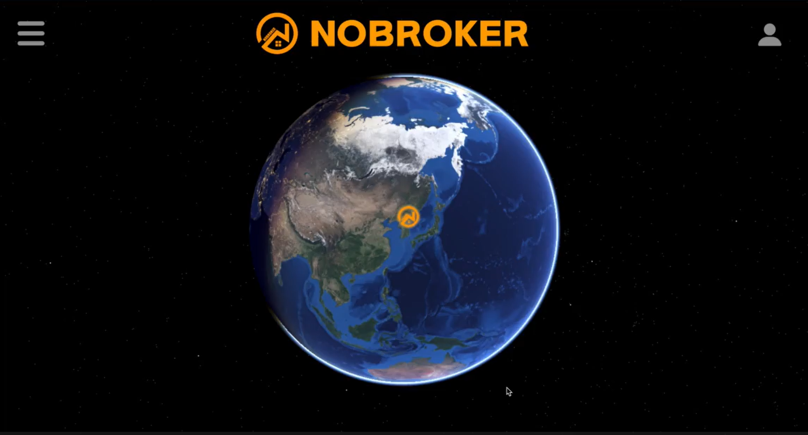

#### 안녕하세요 ! 저는 이재영입니다. :D
풀스택 웹개발과 블록체인 개발을 하고 있습니다.
  

💻 Tech Stack

- Front-End :  
- Back-End  :  
- Database :  
- DevOps :  
  

📫 Contact
- Blog : [velog](https://velog.io/@ijy1995/posts)
- Portfolio : [Lee Jae Yeong](https://zam0ng.github.io/portfolio/) <- 포트폴리오 에서 아래 프로젝트들의 자세한 내용을 확인할 수 있습니다.
  

📁 My Project

<table>
  <tr>
    <td align="left" style="border:1px solid #ccc; border-radius:10px; padding:10px; width:250px;">
      <a href="https://github.com/zam0ng/Real_estate_STO_project" style="text-decoration:none; color:inherit;">
       
      </a>
      <strong>🏠 부동산 STO </strong> 
      부동산 STO 발행 및 거래, 투표 플랫폼 
      <code style="background:#00FFFF; color:#000; padding:4px 8px; border-radius:6px;">React</code>
      <code style="background:#00FF7F; color:#000; padding:4px 8px; border-radius:6px;">NodeJs</code>
      <code style="background:#FFD700; color:#000; padding:4px 8px; border-radius:6px;">TypeScript</code>
      <code style="background:#DA70D6; color:#000; padding:4px 8px; border-radius:6px;">Solidity</code> 
    </td>
    <td align="left" style="border:1px solid #ccc; border-radius:10px; padding:10px; width:250px;">
      <a href="https://github.com/zam0ng/React_Project_NoBroker" style="text-decoration:none; color:inherit;">
       
      </a>
      <strong>Nobroker</strong> 
      부동산 매매 플랫폼 
      <code style="background:#00FFFF; color:#000; padding:4px 8px; border-radius:6px;">React</code>
      <code style="background:#00FF7F; color:#000; padding:4px 8px; border-radius:6px;">NodeJs</code>
      <code style="background:#00FF7F; color:#000; padding:4px 8px; border-radius:6px;">ReactQuery</code>
      <code style="background:#00FF7F; color:#000; padding:4px 8px; border-radius:6px;">Mysql</code>
    </td>
  </tr>
</table>

<!--
**zam0ng/zam0ng** is a ✨ _special_ ✨ repository because its `README.md` (this file) appears on your GitHub profile.

Here are some ideas to get you started:
 
- 🔭 I’m currently working on ...
- 🌱 I’m currently learning ...
- 👯 I’m looking to collaborate on ...
- 🤔 I’m looking for help with ...
- 💬 Ask me about ...
- 📫 How to reach me: ...
- 😄 Pronouns: ...
- ⚡ Fun fact: ...
-->
